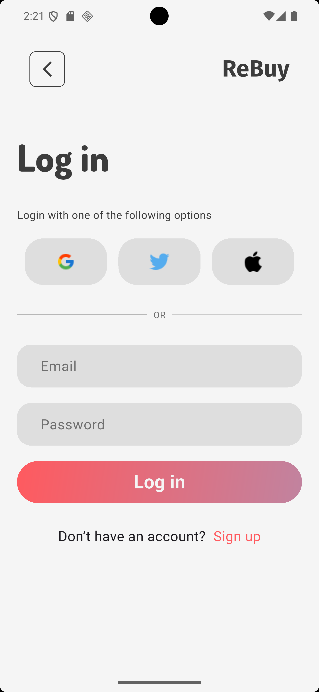
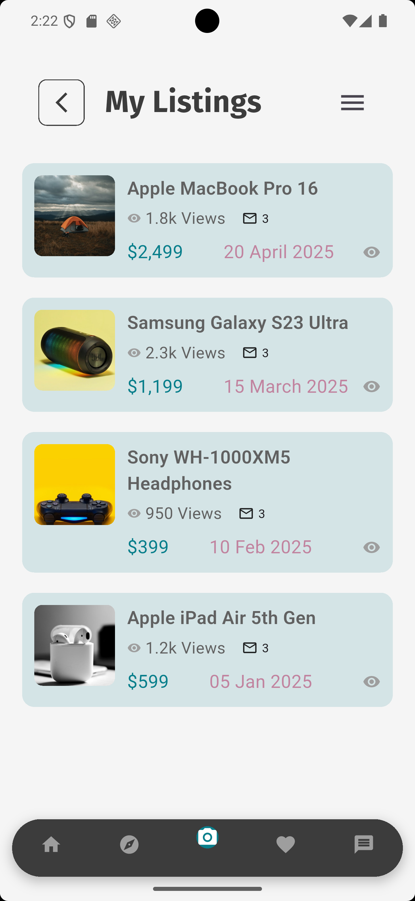
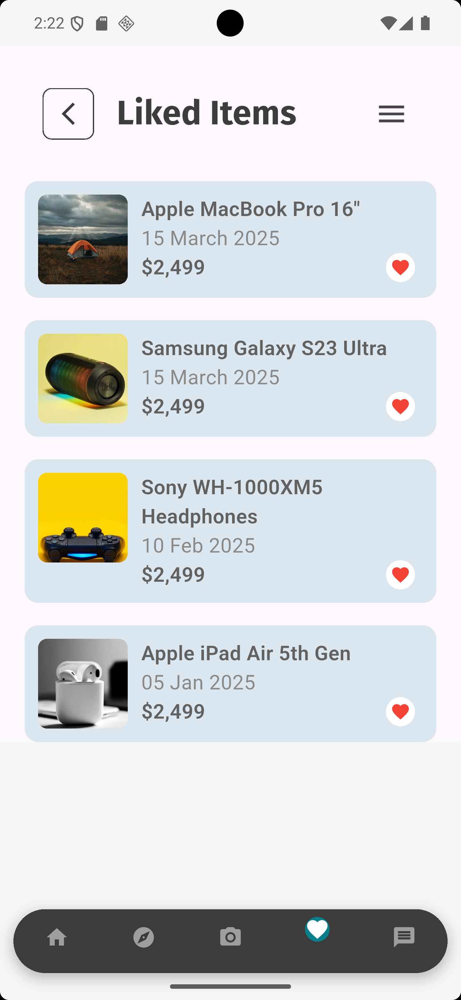
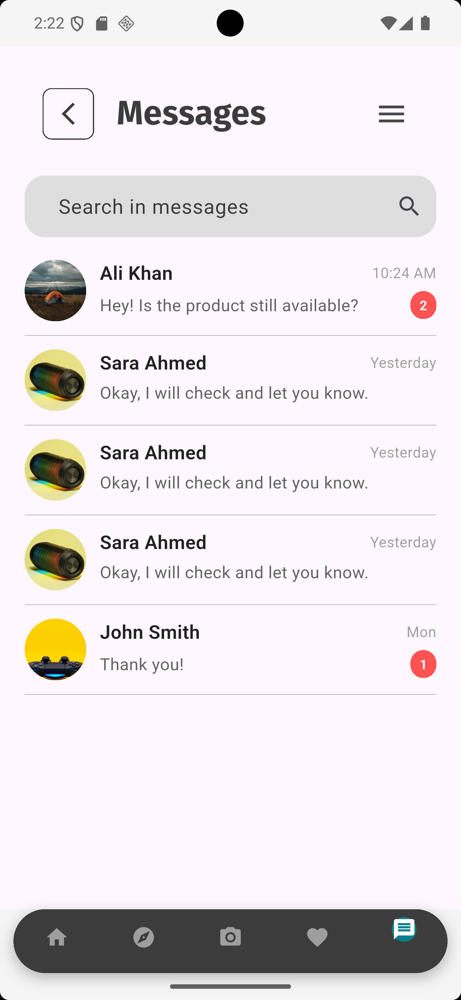
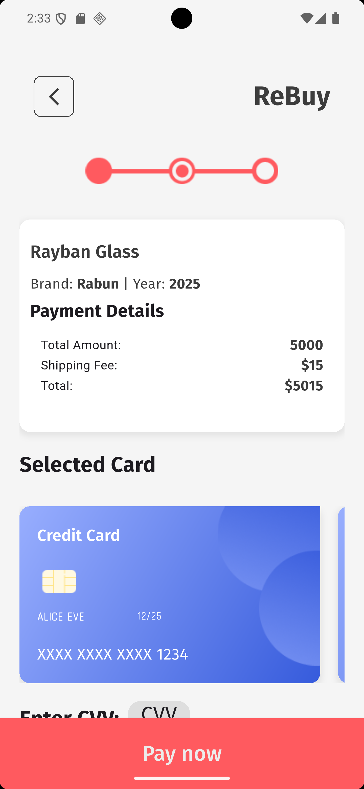
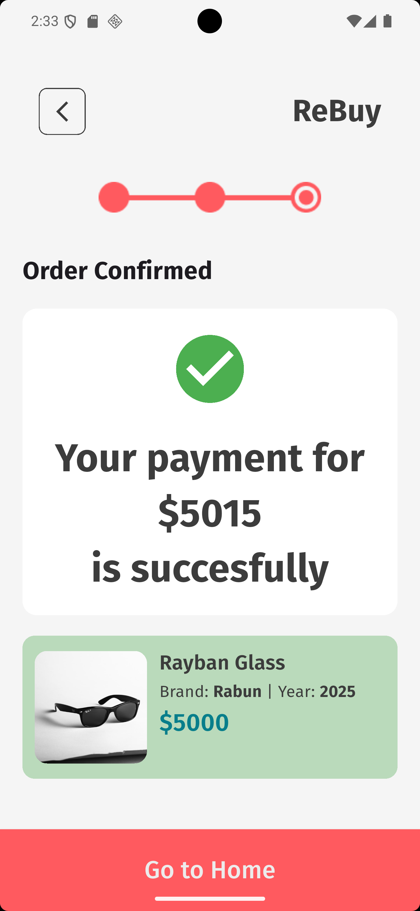

# Rebuy App

Rebuy is a modern Flutter e-commerce application built using **GetX** for state management. This app allows users to browse, add, and purchase products seamlessly, with a clean and intuitive interface.

---

## 📝 Features

- User authentication (Signup / Login)  
- Browse and explore products  
- Add products to catalog  
- Like and wishlist items  
- Messaging between users  
- Detailed product pages  
- Purchase form and payment integration  
- Order confirmation  
- User account management  
- Sidebar navigation  

---

## 📱 Screenshots

| Splash Screen | Login |
|---------------|-------|
|  |  |

| Sign Up | Home Page |
|---------|-----------|
|  |  |

| Explorer | Listing |
|----------|---------|
|  |  |

| Liked Item | Messages |
|------------|----------|
|  |  |

| Sidebar | My Account Details |
|---------|------------------|
|  |  |

| Product Page | Purchase Form |
|--------------|---------------|
|  |  |

| Payment Page | Order Confirmation |
|--------------|------------------|
|  |  |

---

## ⚙️ Installation

1. Clone the repository:
   ```bash
   git clone https://github.com/yourusername/rebuy-flutter-app.git
